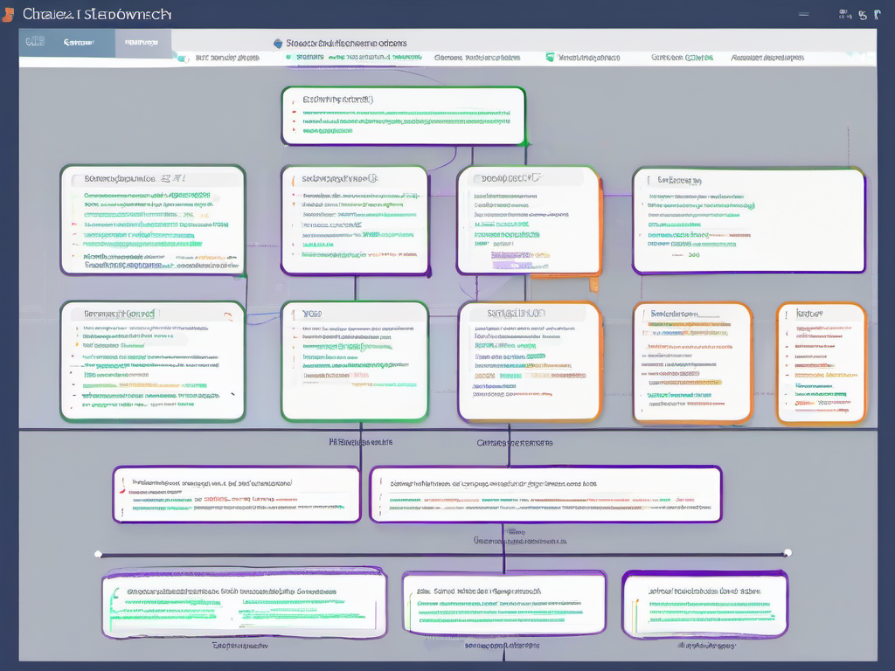

# Architecture

## Overview

Ollama Forge is a VS Code extension that provides a fully local AI coding agent powered by Ollama. All inference runs on your machine or LAN — no cloud, no telemetry.

## Project Type

TypeScript / Node.js VS Code Extension

## Entry Points

- `src/main.ts` — VS Code activation, command registration, view providers
- `src/agent.ts` — core agent loop, tool execution, prompt construction
- `src/provider.ts` — webview message handler, chat session glue
- `webview/webview.html` + `webview/webview.js` — chat UI

## System Diagram

```mermaid
graph TD
    subgraph "VS Code Extension Host"
        MAIN["main.ts<br/>Activation & Commands"]
        PROV["provider.ts<br/>Webview ↔ Agent Bridge"]
        AGENT["agent.ts<br/>Agent Loop & Tool Execution"]
    end

    subgraph "Context & Relevance"
        CTX["context.ts"]
        CTXCALC["contextCalculator.ts"]
        SMART["smartContext.ts"]
        SYM["symbolProvider.ts"]
        CODEIDX["codeIndex.ts"]
        CODEGRAPH["codeGraph.ts"]
        MENTIONS["mentions.ts"]
        GITCTX["gitContext.ts"]
        WS["workspace.ts"]
        FILEPLIT["fileSplitter.ts"]
        SIMILAR["similarityAnalyzer.ts"]
        IMPORTRES["importResolver.ts"]
    end

    subgraph "Memory & Storage"
        MEMCORE["memoryCore.ts"]
        MEMCFG["memoryConfig.ts"]
        EMB["embeddingService.ts"]
        QDRANT["qdrantClient.ts"]
        CHATSTOR["chatStorage.ts"]
        SESSIONLOG["sessionLog.ts"]
    end

    subgraph "Agent Features"
        DEEPRES["deepResearch.ts"]
        SKILL["skillLibrary.ts"]
        MCP["mcpClient.ts"]
        MCPCFG["mcpConfig.ts"]
        DREAM["dreamAgent.ts"]
        STACK["stackHealth.ts"]
        SYSMAP["systemMap.ts"]
        DOCSCAN["docScanner.ts"]
        MDINGEST["markdownIngest.ts"]
        MULTIREF["multiFileRefactor.ts"]
        CMDPOL["commandPolicy.ts"]
        SECRETS["secretRedaction.ts"]
    end

    subgraph "UI Providers"
        COMPLETION["inlineCompletionProvider.ts"]
        CODELENS["codeLensProvider.ts"]
        CODEACT["codeActionsProvider.ts"]
        DIFFVIEW["diffView.ts"]
        MEMVIEW["memoryViewProvider.ts"]
        EXPORTER["chatExporter.ts"]
        TEMPLATES["promptTemplates.ts"]
        MULTIWS["multiWorkspace.ts"]
        ENVPROBE["environmentProbe.ts"]
    end

    subgraph "Infrastructure"
        OLLAMA["ollamaClient.ts"]
        CONFIG["config.ts"]
        LOGGER["logger.ts"]
        WEBGUARD["webviewMsgGuard.ts"]
    end

    %% Entry wiring
    MAIN --> PROV
    MAIN --> AGENT
    PROV --> AGENT

    %% Agent → Context
    AGENT --> CTXCALC
    AGENT --> CODEIDX
    AGENT --> CODEGRAPH
    AGENT --> FILEPLIT
    AGENT --> SIMILAR
    AGENT --> IMPORTRES
    AGENT --> WS
    AGENT --> DOCSCAN
    AGENT --> MULTIREF
    AGENT --> CMDPOL
    AGENT --> SECRETS
    AGENT --> SESSIONLOG
    AGENT --> SYSMAP
    AGENT --> DIFFVIEW

    %% Agent → Memory
    AGENT --> MEMCORE
    AGENT --> CHATSTOR

    %% Agent → Features (dynamic import)
    AGENT -.-> DEEPRES
    AGENT -.-> SKILL
    AGENT --> MCP

    %% Provider → Context
    PROV --> CTX
    PROV --> SMART
    PROV --> SYM
    PROV --> MENTIONS
    PROV --> GITCTX
    PROV --> CODEIDX
    PROV --> DIFFVIEW
    PROV --> TEMPLATES
    PROV --> SESSIONLOG
    PROV --> MULTIWS
    PROV --> WEBGUARD

    %% Provider → Memory
    PROV --> MEMCORE
    PROV --> CHATSTOR

    %% Provider → Features
    PROV --> DREAM

    %% Main → UI Providers
    MAIN --> COMPLETION
    MAIN --> CODELENS
    MAIN --> CODEACT
    MAIN --> MEMVIEW
    MAIN --> EXPORTER
    MAIN --> TEMPLATES
    MAIN --> MULTIWS
    MAIN --> ENVPROBE
    MAIN --> DREAM
    MAIN --> STACK
    MAIN --> SYSMAP
    MAIN --> DOCSCAN
    MAIN --> MDINGEST
    MAIN --> MCP
    MAIN --> MCPCFG

    %% Memory internals
    MEMCORE --> EMB
    MEMCORE --> QDRANT
    MEMCORE --> MEMCFG
    EMB --> MEMCFG
    QDRANT --> MEMCFG

    %% CodeIndex → Memory
    CODEIDX --> EMB
    CODEIDX --> MEMCFG
    CODEIDX --> WS

    %% Dream → others
    DREAM --> AGENT
    DREAM --> CODEIDX
    DREAM --> MEMCORE
    DREAM --> STACK
    DREAM --> SESSIONLOG

    %% All → Infrastructure
    AGENT --> OLLAMA
    AGENT --> CONFIG
    AGENT --> LOGGER
    PROV --> OLLAMA
    PROV --> CONFIG
    PROV --> LOGGER
    MAIN --> OLLAMA
    MAIN --> CONFIG
    MAIN --> LOGGER
    OLLAMA --> CONFIG
    OLLAMA --> LOGGER

    %% ContextFanout (unified relevance query)
    CTXFANOUT["contextFanout.ts"]
    AGENT -.-> CTXFANOUT
    CTXFANOUT -.-> CODEGRAPH
    CTXFANOUT -.-> CODEIDX
    CTXFANOUT -.-> MEMCORE
```



<details>
<summary>Interactive Mermaid diagram (click to expand)</summary>



**Legend:** Solid arrows = static import. Dashed arrows = dynamic `await import()`.

</details>

## Build Pipeline

```
npm run bundle:prod
  └─ scripts/vendor-hljs.js   → webview/vendor/highlight.bundle.js
  └─ esbuild.js --production  → dist/main.js (all deps bundled)
     └─ native modules copied: tree-sitter, tree-sitter-typescript,
                               tree-sitter-python, better-sqlite3
```

| Script | What it does |
|---|---|
| `npm run vendor` | Rebuild the highlight.js browser bundle |
| `npm run compile` | TypeScript compile (tsc) — for type checking / tests |
| `npm run bundle` | esbuild dev bundle → dist/main.js |
| `npm run bundle:prod` | esbuild production bundle (minified) |
| `npm run deploy` | bundle + copy to local VS Code extension dir |
| `npm run package` | build + vsce package → .vsix |
| `npm test` | compile + vscode-test integration suite |
| `npm run test:unit` | mocha unit tests only |
| `npm run test:coverage` | unit tests with nyc coverage |

## Source Map (48 modules)

### Entry Layer
| File | Role |
|---|---|
| `main.ts` | VS Code activation, command registration, provider wiring |
| `provider.ts` | Webview message handler, chat session glue, context assembly |
| `agent.ts` | Agent loop, tool definitions, prompt builder, tool dispatch |

### Context & Relevance
| File | Role |
|---|---|
| `context.ts` | Workspace context builder (active file, selection, open tabs) |
| `contextCalculator.ts` | Token counting, context window management, history compaction |
| `smartContext.ts` | Import-aware file relevance scoring |
| `symbolProvider.ts` | Symbol indexing, fuzzy search |
| `codeIndex.ts` | File relevance indexing (vector + keyword) |
| `codeGraph.ts` | tree-sitter code graph, scope routing, ROUTER.md generation |
| `mentions.ts` | `@file` mention parsing, workspace file indexing |
| `gitContext.ts` | git diff, blame, commit context |
| `workspace.ts` | File tree building, project type detection, recently-modified |
| `fileSplitter.ts` | Large file split planning |
| `similarityAnalyzer.ts` | Cross-file similarity detection |
| `importResolver.ts` | Python import validation, doctest probing, registry checks |
| `contextFanout.ts` | Unified relevance query — fans out to codeIndex + memory in parallel with token budgets and dedup. Dynamically imported by `agent.ts`. |

### Memory & Storage
| File | Role |
|---|---|
| `memoryCore.ts` | 6-tier memory system (SQLite + Qdrant) |
| `memoryConfig.ts` | Memory tier configuration |
| `embeddingService.ts` | Qdrant embedding calls |
| `qdrantClient.ts` | Qdrant vector DB client |
| `chatStorage.ts` | SQLite-backed chat session persistence |
| `sessionLog.ts` | Append-only session event log |

### Agent Features
| File | Role |
|---|---|
| `deepResearch.ts` | Deep research: fan-out search, fetch, claim extraction, cited synthesis |
| `skillLibrary.ts` | Skill manifests: load, validate, resolve, trigger matching + hint formatting from `.ollamaforge/skills/` |
| `mcpClient.ts` | MCP server client (tool discovery + invocation) |
| `mcpConfig.ts` | MCP server config loading/validation |
| `dreamAgent.ts` | Dream cycle: self-review, memory compaction, rule proposals |
| `stackHealth.ts` | SSH-based service health checks |
| `systemMap.ts` | Cross-workspace knowledge graph (nodes, edges, decay) |
| `docScanner.ts` | Project doc ingestion into memory |
| `markdownIngest.ts` | Markdown file ingestion pipeline |
| `multiFileRefactor.ts` | Multi-file refactoring plan execution |
| `commandPolicy.ts` | Shell command safety evaluation, egress checks |
| `secretRedaction.ts` | Secret detection and redaction in tool output |

### UI Providers
| File | Role |
|---|---|
| `inlineCompletionProvider.ts` | Ghost-text completions |
| `codeLensProvider.ts` | Code lens actions |
| `codeActionsProvider.ts` | Quick-fix / refactor actions |
| `diffView.ts` | Proposed-change diff viewer |
| `memoryViewProvider.ts` | Memory sidebar tree view |
| `chatExporter.ts` | Markdown / JSON chat export |
| `promptTemplates.ts` | Reusable prompt template system |
| `multiWorkspace.ts` | Per-folder workspace isolation |
| `environmentProbe.ts` | Shell/tool detection (git, node, python…) |

### Infrastructure
| File | Role |
|---|---|
| `ollamaClient.ts` | Ollama HTTP client (streaming, keep-alive, model listing) |
| `config.ts` | Settings schema, model presets, `getConfig()` |
| `logger.ts` | File + output channel logging |
| `webviewMsgGuard.ts` | Webview message validation |

## Key Systems

### Agent Loop (`src/agent.ts`)
The agent receives a user message, builds a prompt with context (files, memory, git diff, etc.), streams a response from Ollama, parses `<tool>` calls from the output, executes them, and feeds results back for the next turn. Continues until the model emits no more tool calls.

Tool execution goes through a middleware chain: trust-level check → approval prompt (if needed) → execution → result injection.

Multi-model routing optionally sends read-only tool turns to a fast/cheap model and critique turns to a larger one.

**Dynamic imports** (loaded on demand to keep initial bundle lean):
- `deepResearch` — loaded when the model calls the `deep_research` tool
- `skillLibrary` — loaded when the model calls the `use_skill` tool

### Memory System (`src/memoryCore.ts`)
Six tiers, lowest = most important:

| Tier | Storage | Description |
|---|---|---|
| 0 | SQLite | Critical facts (always loaded) |
| 1 | SQLite | Session summaries |
| 2 | SQLite | Project conventions |
| 3 | SQLite | Historical context |
| 4 | Qdrant | Semantic search (vector) |
| 5 | Qdrant | Archive |

Tiers 0–3 load automatically on session start. Tiers 4–5 require Qdrant.

### Code Graph (`src/codeGraph.ts`)
tree-sitter parses TypeScript and Python files into a scope graph. The agent uses this to find the right files/symbols for a given task rather than loading everything into context. Also generates/maintains `ROUTER.md` for semantic file routing.

### Dream Cycle (`src/dreamAgent.ts`)
Runs nightly (or on demand). Compacts memory, reviews recent sessions, proposes new agent rules, and optionally runs stack health checks over SSH.

### MCP Client (`src/mcpClient.ts`)
Connects to any MCP-compatible tool server. Config lives in `.ollamaforge/mcp.json` or the `ollamaForge.mcpServers` setting. See [mcp.example.json](mcp.example.json) for server examples.

### Skill Library (`src/skillLibrary.ts`)
Loads JSON skill manifests from `.ollamaforge/skills/`. Each skill bundles a prompt fragment, a tool allowlist, an optional model override, and optional trigger keywords (`trigger` or `triggers`). Activated at runtime via the `use_skill` agent tool. When active, restricts the available tool set and injects the skill's prompt into the system message. Skills with triggers also appear as hints in the system prompt when the user's query matches a trigger keyword, nudging the agent to consider activating them.

### Deep Research (`src/deepResearch.ts`)
Orchestrates multi-step research: fan-out web search → page fetch → claim extraction → cross-referencing → cited synthesis. Runs as a single agent tool call, returning a structured research report.

## Dependencies

| Package | Purpose |
|---|---|
| `@modelcontextprotocol/sdk` | MCP server communication |
| `axios` | HTTP client (Ollama API, web fetch) |
| `better-sqlite3` | Local SQLite for memory and chat storage |
| `tree-sitter` + grammars | Code parsing for the code graph |
| `highlight.js` | Syntax highlighting in the webview (vendored) |

## Webview

The chat UI (`webview/`) is plain HTML/JS — no framework. It communicates with the extension host via `vscode.postMessage` / `onmessage`. The highlight.js bundle is vendored at `webview/vendor/highlight.bundle.js` so it works offline without a CDN.

## Tests

```
src/test/
├── unit/          # Mocha tests, no VS Code API dependency
└── integration/   # vscode-test tests (require Extension Host)
```

Run with `npm run test:unit` (fast, no VS Code needed) or `npm test` (full suite).

## Known Gaps

| Module | Status | Notes |
|---|---|---|
| `contextFanout.ts` | ✅ Wired | Dynamically imported by `agent.ts` during context assembly. Fans out to codeIndex + memory in parallel with token budgets and dedup. |
